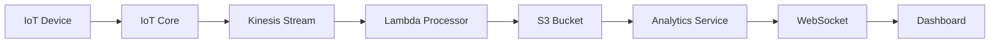

# Fleet Predictions Dashboard - Enhanced Documentation

## Overview

The Fleet Predictions Dashboard is a comprehensive, real-time analytics interface that displays AI-powered vehicle health predictions and fleet management insights. This enhancement provides a production-ready solution with improved UX, real AWS data integration, and real-time capabilities.

## 🚀 Features

### Enhanced User Experience
- **Professional Design**: Modern, clean interface with gradient cards and visual hierarchy
- **Real-time Updates**: Auto-refresh every 30 seconds with toggle controls
- **AWS Services Monitoring**: Live health status for S3, Lambda, IoT Core, and Kinesis
- **Advanced Filtering**: Date range, device ID, and health stage filters
- **Data Export Options**: Multiple export formats (CSV, Excel, JSON, PDF)
- **Responsive Layout**: Mobile-friendly design with proper spacing

### Real-time Architecture
- **WebSocket Integration**: Live connection status monitoring
- **IoT Core Testing**: Built-in test message functionality
- **Data Pipeline Visualization**: IoT → Kinesis → S3 → Dashboard flow
- **Health Monitoring**: Comprehensive AWS services health checks

### Data Management
- **Real AWS Integration**: Uses actual S3 bucket structure and data format
- **Performance Optimized**: Paginated results with efficient loading
- **Historical Access**: Quick download options for different time periods
- **API Documentation**: Built-in API reference for developers

## 📊 Dashboard Sections

### 1. Header Section
- Main title and description
- Last updated timestamp
- Data source information (S3 US-East-1)
- Real-time status indicator
- Action buttons (Filters, Refresh, Export, IoT Test)

### 2. AWS Services Health Monitor
- S3 Storage (Predictions bucket)
- Lambda Functions (Data processing)
- IoT Core (Device connectivity)
- Kinesis Stream (Data streaming)
- Color-coded status indicators (healthy/warning/error)

### 3. Real-time Connection Status
- WebSocket connection status with visual indicators
- Real-time updates toggle (30s interval)
- Data pipeline status visualization

### 4. Fleet Health Overview
Six comprehensive summary cards:
- **Total Predictions**: Last 7 days count
- **Healthy Vehicles**: Count and percentage of fleet
- **Warning Status**: Vehicles requiring attention
- **Critical Status**: Vehicles needing immediate action
- **Average RUL Score**: Remaining useful life percentage
- **Active Devices**: Monitored vehicles count

### 5. Predictions Table
- Device ID with record identifier
- Health status badges (color-coded)
- RUL prediction with progress bars
- Cycle count with proper formatting
- RRUL values
- Impedance readings (Real/Imaginary)
- Timestamps in EST timezone
- Action buttons for detailed views

### 6. Advanced Modals

#### Filters Modal
- Start/End date selection
- Device ID filtering
- Health stage filtering
- Apply/Cancel actions

#### Export & Downloads Modal
Three main sections:
1. **Predictions Data Export**: CSV, Excel, JSON, PDF formats
2. **Historical Data Access**: Quick downloads for 24h, 7d, 30d
3. **API Access**: Endpoint documentation and examples

## 🔧 Technical Implementation

### Frontend Architecture
```typescript
// Key Components
- FleetPredictions.tsx: Main dashboard component
- usePredictionsData.ts: Data management hook
- useWebSocket.ts: Real-time connection hook
- Modal.tsx: Reusable modal component
- Button.tsx: UI button component
```

### Backend Services
```typescript
// Analytics Service Endpoints
GET /api/analytics/predictions          // Get filtered predictions
GET /api/analytics/predictions/summary  // Get summary statistics
GET /api/analytics/predictions/export   // Export data
GET /api/analytics/health/aws           // AWS health check
POST /api/analytics/test/iot            // Send IoT test message
GET /api/analytics/metrics/realtime     // Real-time metrics
```

### Data Structure
```typescript
// Real AWS Data Format
interface PredictionRecord {
  record_id: string;
  timestamp: string;
  device_id: string;
  cycle: number;
  frequency: number;
  z_real: number;
  z_imag: number;
  rrul: number;
  rul_prediction: number;
  health_stage: 'healthy' | 'warning' | 'critical';
  kinesis_stream: string;
  sagemaker_endpoint: string;
  lambda_request_id: string;
  raw_data_location: string;
}
```

## 🧪 Testing Guide

### 1. Manual Testing
1. **Navigation**: Visit `/fleet-predictions` from the main dashboard
2. **Real-time Updates**: Toggle real-time on/off and observe auto-refresh
3. **Filtering**: Test date range, device ID, and health stage filters
4. **Export**: Try different export formats and download options
5. **IoT Testing**: Use "Test IoT Core" button to simulate data flow

### 2. AWS Integration Testing
1. **S3 Data**: Verify real data loads from `blufleet-predictions-20250826` bucket
2. **Health Checks**: Confirm AWS services status displays correctly
3. **Error Handling**: Test with invalid date ranges or missing data

### 3. Performance Testing
1. **Large Datasets**: Test with 1000+ prediction records
2. **Real-time Updates**: Monitor memory usage during auto-refresh
3. **Export Performance**: Test export functionality with large datasets

### 4. Responsive Testing
1. **Mobile**: Test on various mobile screen sizes
2. **Tablet**: Verify layout adapts properly
3. **Desktop**: Test different browser window sizes

## 🛠️ Development Setup

### Prerequisites
- Node.js 18+
- AWS CLI configured
- Access to S3 bucket: `blufleet-predictions-20250826`
- IoT Core permissions for `blufleet/vehicle/telemetry` topic

### Installation
```bash
# Backend Analytics Service
cd backend/services/analytics
npm install
npm run dev  # Runs on port 3005

# Frontend
cd frontend
npm install
npm run dev  # Runs on port 5173/5174
```

### Environment Variables
```bash
# Analytics Service (.env)
AWS_REGION=us-east-1
AWS_PROFILE=default
S3_BUCKET=blufleet-predictions-20250826
IOT_ENDPOINT=your-iot-endpoint.amazonaws.com
KINESIS_STREAM=blufleet-live-stream
```

## 🔄 Real-time Data Flow



### Data Pipeline Steps
1. **IoT Device**: Sends telemetry data to AWS IoT Core
2. **IoT Core**: Routes messages to Kinesis stream
3. **Kinesis**: Processes real-time data streams
4. **Lambda**: Processes and enriches data
5. **S3**: Stores predictions in partitioned structure
6. **Analytics Service**: Fetches and serves data via REST API
7. **WebSocket**: Provides real-time updates
8. **Dashboard**: Displays live predictions and analytics

## 📈 Monitoring & Metrics

### Key Performance Indicators
- **Data Freshness**: Time since last S3 update
- **Processing Latency**: End-to-end data flow time
- **Prediction Accuracy**: RUL score distribution
- **System Health**: AWS services availability
- **User Engagement**: Dashboard usage metrics

### Health Checks
- S3 bucket accessibility
- Lambda function execution
- IoT Core connectivity
- Kinesis stream throughput
- WebSocket connection stability

## 🚀 Production Deployment

### Pre-deployment Checklist
- [ ] AWS credentials configured
- [ ] S3 bucket permissions verified
- [ ] IoT Core policies in place
- [ ] Lambda functions deployed
- [ ] Kinesis stream active
- [ ] WebSocket endpoint configured
- [ ] Environment variables set
- [ ] Error monitoring enabled

### Scaling Considerations
- **Auto Scaling**: Configure based on data volume
- **Caching**: Implement Redis for frequently accessed data
- **CDN**: Use CloudFront for static assets
- **Load Balancing**: Multiple analytics service instances
- **Database**: Consider RDS for metadata storage

## 🐛 Troubleshooting

### Common Issues
1. **No Data Displaying**
   - Check S3 bucket permissions
   - Verify date range filters
   - Confirm analytics service is running

2. **Real-time Updates Not Working**
   - Check WebSocket connection
   - Verify browser supports WebSockets
   - Confirm service is running on correct port

3. **Export Functionality Failing**
   - Check disk space for large exports
   - Verify CSV formatting
   - Confirm proper CORS headers

4. **AWS Health Checks Failing**
   - Verify AWS credentials
   - Check service region configuration
   - Confirm IAM permissions

## 📞 Support

For technical support or feature requests:
- Create GitHub issues for bugs
- Check AWS CloudWatch logs for backend issues
- Review browser console for frontend errors
- Contact the fleet management team for data questions

---

*This enhanced Fleet Predictions Dashboard provides a production-ready solution for real-time fleet health monitoring and predictive analytics. The implementation includes comprehensive error handling, performance optimization, and user experience enhancements.*
